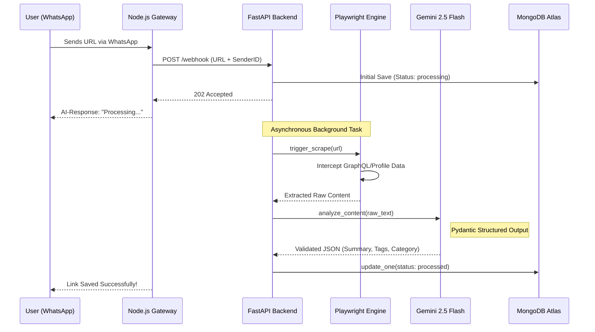

# 📱 Social Saver
**An AI-driven personal knowledge management system for link preservation and semantic organization.**

[](https://github.com/)
[](https://ai.google.dev/)
[](https://playwright.dev/)
[](https://fastapi.tiangolo.com/)

---

## �️ System Architecture

Social Saver employs a decoupled architecture optimized for low-latency ingestion and high-fidelity content extraction.



---

## 🚀 Core Technologies

### 1. Ingestion Engine (`Node.js`)
- **Gateway**: `whatsapp-web.js` acts as a headless interface for the WhatsApp protocol.
- **Identity Bridge**: Maps `WhatsAppSenderID` to `ClerkUserEmail` via the `/link-user` command, enabling secure multi-tenant access to the web dashboard.

### 2. Processing Pipeline (`FastAPI`)
- **Asynchronous Execution**: Leverages FastAPI `BackgroundTasks` to offload scraping and AI processing, ensuring immediate response times ($<$200ms) for the WhatsApp gateway.
- **Intelligence Layer**: Utilizes `Gemini 2.5 Flash` with **Structured Outputs**. We enforce a strict Pydantic schema for every inference to ensure zero-shot classification reliability.

### 3. Extraction Strategy (`Playwright` & `Trafilatura`)
- **Dynamic Content**: For JavaScript-heavy platforms (e.g., Instagram), Social Saver intercepts internal GraphQL and Profile JSON responses to bypass DOM clutter and extract the "ground truth" data.
- **Semantic Extraction**: Uses `Trafilatura` for generic articles to maximize SNR (Signal-to-Noise Ratio) in training-free metadata generation.

---

## 🛠️ API Specification

### `POST /webhook`
Handles incoming signals from the WhatsApp bot.
- **Payload**: `{ "url": "string", "sender": "string" }`
- **Internal Logic**: Performs user lookup, persists initial document state, and spawns background worker.

### `POST /link-user`
Maps a physical WhatsApp identity to a cloud account.
- **Payload**: `{ "phone": "string", "email": "string" }`
- **Persistence**: Upserts record into `user_mappings` collection.

---

## ⚙️ Deployment & Scaling

### Local Development Setup
1. **Clone & Initialize Backend**:
   ```bash
   cd backend
   python -m venv venv
   source venv/Scripts/activate # Windows: .\venv\Scripts\activate
   pip install -r requirements.txt
   npm install # For WhatsApp gateway dependencies
   ```
2. **Configure Environment**:
   ```env
   # backend/.env
   MONGO_URI=mongodb+srv://...
   GEMINI_API_KEY=...
   ```
3. **Execute Services**:
   - API: `uvicorn main:app --reload --port 8000`
   - Bot: `node bot.js`
   - UI: `cd frontend && npm run dev`

---

## 🛡️ Security & Observability
- **Data Privacy**: No conversation history is stored; only explicit URLs are processed through the transient extraction buffer.
- **Failsafe Logic**: Implements fallback "Motivation" categorization if semantic signals are insufficient, preventing pipeline deadlocks.
- **Network Isolation**: Internal service communication is constrained to loopback within containerized environments (Render/Docker).

---

## 👨‍💻 Engineering
**Developer**: Sakina  
**Focus**: AI Engineering & Full-Stack Systems
